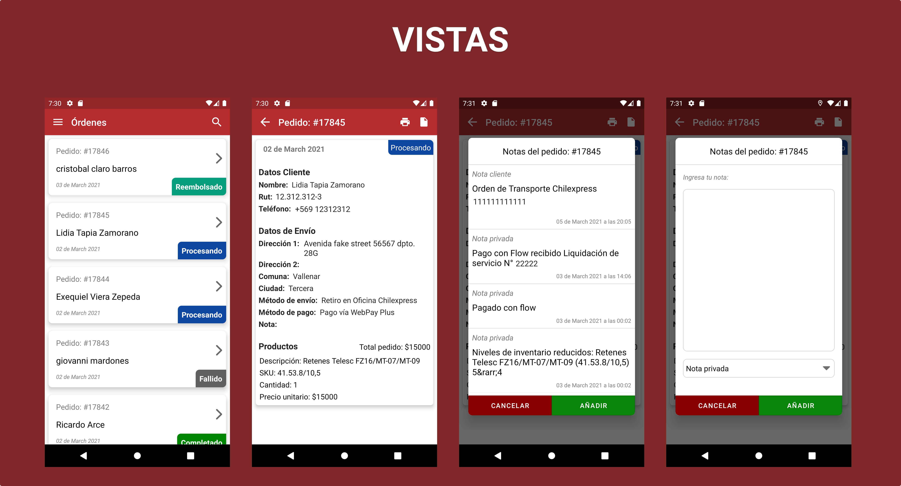

<h1 align="center">Tiempo de Motos Admin</h1>

  
Aplicación móvil desarrollada para simplificar manejo de información relacionada a las ventas realizadas en el sitio www.tiempodemotos.cl

 

## Stack

- Language
  - Kotlin
  - XML
- JetPack
  - LiveData
  - Lifecycle
  - ViewModel
- Dependency Injector
  - Dagger Hilt
- Network
  - [Retrofit](https://github.com/square/retrofit)
  - [OkHTTP](https://github.com/square/okhttp)
- JSON Parses
  - GSON
- UI
  - Material Components
- Firebase
  - Messaging
  - Analytics
  - Crashlytics
- Logging
  - Timber
- Paging
  - Paging 3
